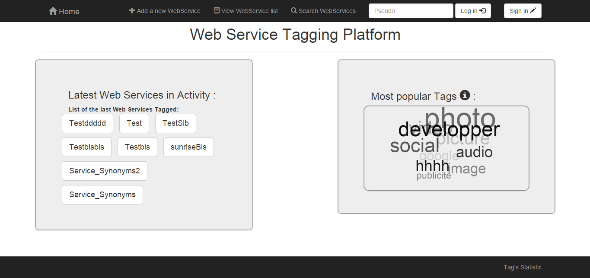

# WSTP
WSTP (Web Service Tagging Platform) est le projet assigné en Master 2.
Depuis une application existante, nous devons en groupe de 3 améliorer l'application graphiquement et fonctionnellement. 

C'est un projet qui se base sur la participation des utilisateurs afin de référencer les web services à l'aide des "tags". Utiliser les "tags" pour rechercher les web services permettent d'affiner sa requête non seulement à l'aide des poids, mais aussi avec le nombre d'information variable que l'on peut lui transmettre se caractérisant pour le nombre de "tag" que l'on utilise pour la recherche.

##version
0.9